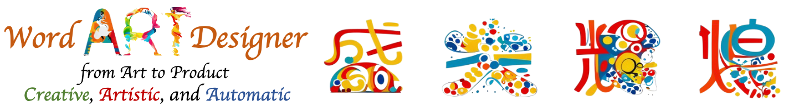
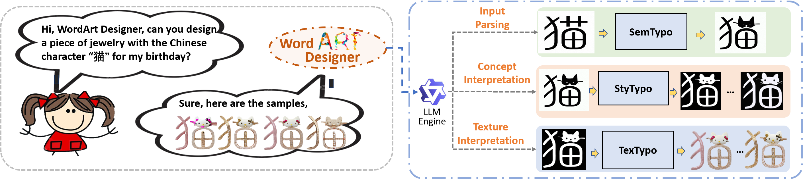
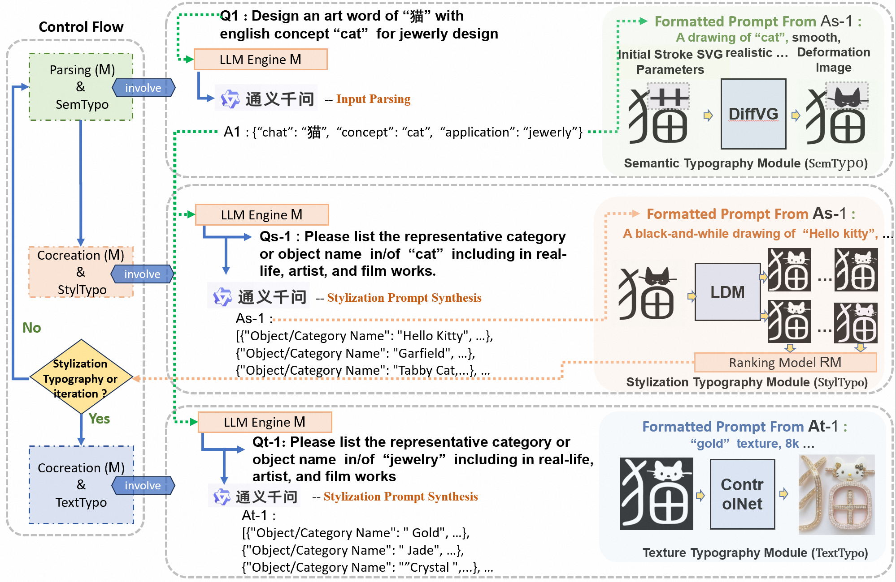

# WordArt Designer (创意艺术字设计)
<div align="center">
  
</div>

## Framework
**WordArt Designer**  introduces a user-driven framework for artistic typography synthesis, relying on Large Language Models (LLM). The system incorporates four key modules: the LLM Engine, SemTypo, StyTypo, and TexTypo modules. 1) The LLM Engine, empowered by LLM (e.g. Tongyi QWen), interprets user inputs and generates actionable prompts for the other modules, thereby transforming abstract concepts into tangible designs. 2) The SemTypo module optimizes font designs using semantic concepts, striking a balance between artistic transformation and readability. 3) Building on the semantic layout provided by the SemTypo module, the StyTypo module creates smooth, refined images. 4) The TexTypo module further enhances the design's aesthetics through texture rendering, enabling the generation of inventive textured fonts. Notably, WordArt Designer highlights the fusion of generative AI with artistic typography. 

**Modelscope 创意艺术字设计 创空间试用** Link：https://modelscope.cn/studios/WordArt/WordArt/summary 
**Modelscope开源代码，代码体验** Link：https://modelscope.cn/models/jyhe21/wordart_designer/summary


<div align="center">
  
  <br>
  <i>图 1: The Introducing of WordArt Designer .</i>
</div>


<div align="center">
  
  <br>
  <i>图 1: WordArt Designer Framework.</i>
</div>


## Citation

```bibtex
@misc{he2023wordart,
      title={wordart designer: user-driven artistic typography synthesis using large language models}, 
      author={Jun-Yan He and Zhi-Qi Cheng and Chenyang Li and jingdong Sun and Wangmeng Xiang and Xianhui Lin, and Xiaoyang Kang and Zengke Jin and Yusen Hu and Bin Luo and Yifeng Geng and Xuansong Xie and Jingren Zhou},
      year={2023},
      eprint={2310.18332},
      primaryClass={cs.CV}
}

@misc{he2024wordartapi,
      title={wordart designer API: User-Driven Artistic Typography Synthesis with Large Language Models on ModelScope}, 
      author={Jun-Yan He and Zhi-Qi Cheng and Chenyang Li and jingdong Sun and Wangmeng Xiang and Xianhui Lin, and Xiaoyang Kang and Zengke Jin and Yusen Hu and Bin Luo and Yifeng Geng and Xuansong Xie and Jingren Zhou},
      year={2024},
      eprint={2401.01699},
      primaryClass={cs.CV}
}
```